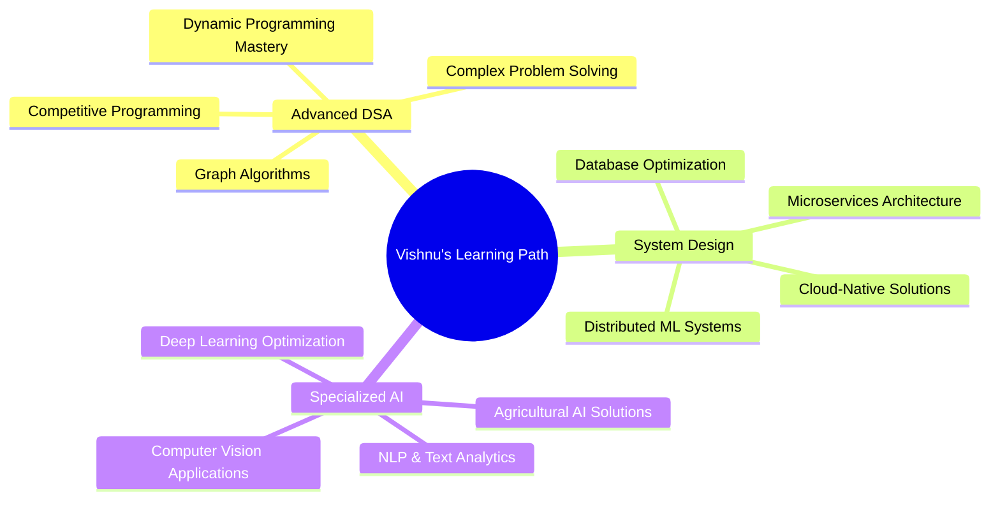

# 🧠 Vishnu Vardhan Mamidisetti

<div align="center">
  
</div>

---

## 🎯 Professional Overview

> *"Data tells a story; I help it speak through intelligent machine learning solutions"*

I'm a **high-achieving Computer Science student** with an exceptional **9.4 CGPA** at **SR University, Warangal**, specializing in **Data Science**, **Machine Learning**, and **Deep Learning**. My passion lies in transforming complex data into actionable insights and building scalable ML solutions that solve real-world agricultural and healthcare challenges.

```python
class VishnuVardhanMamidisetti:
    def __init__(self):
        self.name = "Vishnu Vardhan Mamidisetti"
        self.role = "Aspiring Data Scientist & ML Engineer"
        self.education = {
            "degree": "B.Tech Computer Science Engineering",
            "university": "SR University, Warangal",
            "duration": "Oct 2022 - May 2026",
            "cgpa": 9.4,
            "status": "High Academic Performer"
        }
        self.expertise = [
            "Machine Learning", "Deep Learning", "Data Analytics",
            "Computer Vision", "Agricultural AI", "Healthcare ML"
        ]
        self.tech_stack = {
            "languages": ["Python", "SQL"],
            "ml_frameworks": ["TensorFlow", "PyTorch", "scikit-learn"],
            "data_tools": ["Pandas", "NumPy", "Matplotlib", "Seaborn"],
            "cloud": ["Microsoft Azure"],
            "databases": ["PostgreSQL", "MySQL"]
        }
        self.achievements = [
            "Google Data Analytics Professional Certificate",
            "Meta Database Engineer Professional Certificate", 
            "Microsoft Azure Fundamentals (AZ-900)",
            "NPTEL Theory of Computation Certificate"
        ]
        self.current_projects = [
            "Intelligent Crop Prediction System",
            "Advanced Plant Disease Detection using CNN"
        ]
    
    def get_vision(self):
        return "Building AI solutions that transform agriculture and healthcare industries"
    
    def get_motto(self):
        return "Code with purpose, learn with passion, grow with persistence"
    
    def current_focus(self):
        return {
            "learning": ["Advanced DSA", "MLOps", "System Design", "Model Optimization"],
            "building": ["Production ML Pipelines", "Scalable AI Applications"],
            "competing": ["LeetCode Problem Solving", "Kaggle Competitions"],
            "goal": "Data Scientist role at leading tech companies"
        }

vishnu = VishnuVardhanMamidisetti()
print(f"Vision: {vishnu.get_vision()}")
print(f"Motto: {vishnu.get_motto()}")
```

---

## 🎓 Academic Excellence

<div align="center">

| 📚 **Degree** | 🏛️ **Institution** | 📅 **Duration** | 📊 **Performance** | 🎯 **Status** |
|:---:|:---:|:---:|:---:|:---:|
| **B.Tech Computer Science** | SR University, Warangal | Oct 2022 - May 2026 | **9.4/10.0 CGPA** ⭐ | **Top Performer** |

</div>

---

## 🏆 Professional Certifications & Achievements

<div align="center">

| 🎖️ **Certification** | 🏢 **Provider** | 📋 **Category** | 🔗 **Status** |
|:---:|:---:|:---:|:---:|
| **Data Analytics Professional** | Google | Data Science | ✅ **Certified** |
| **Database Engineer Professional** | Meta | Database Management | ✅ **Certified** |
| **Azure Fundamentals (AZ-900)** | Microsoft | Cloud Computing | ✅ **Certified** |
| **Theory of Computation** | NPTEL | Computer Science | ✅ **Completed** |

</div>

---

## 🛠️ **Tech Stack Overview**

<div align="center">

### 💻 **Programming Languages**


### 🤖 **Machine Learning & AI**

<br>


### 📊 **Data Visualization & Analysis**

<br>


### 🗄️ **Databases**


### ☁️ **Cloud & DevOps**


### 🏆 **Competitive Platforms**

<br>


</div>

<details>
<summary>📋 <b>Detailed Technical Proficiency</b></summary>

### 💻 **Core Programming**


### 🤖 **Machine Learning & AI**


### 📊 **Data & Visualization**


### 🗄️ **Databases**


### ☁️ **Cloud & DevOps**


### 🏆 **Competitive Programming**


</details>

---

## 🌟 Flagship Projects

<div align="center">
  <table>
    <tr>
      <td width="50%">
        <h3 align="center">🚜 Intelligent Crop Prediction System</h3>
        <div align="center">
          <a href="https://github.com/VISHNU-VARDHAN-MAMIDISETTI1/Crop-Prediction-using-ml" target="_blank">
            
          </a>
          <br><br>
          <p>
            <b>🎯 Impact:</b> Revolutionizing agriculture through ML-driven crop optimization<br>
            <b>🔧 Tech Stack:</b> Python, scikit-learn, Streamlit, Data Analysis<br>
            <b>📊 Achievement:</b> High accuracy crop recommendations based on soil & climate<br>
            <b>🌱 Domain:</b> Agricultural Technology & Smart Farming
          </p>
        </div>
      </td>
      <td width="50%">
        <h3 align="center">🥔 Advanced Plant Disease Detection</h3>
        <div align="center">
          <a href="https://github.com/VISHNU-VARDHAN-MAMIDISETTI1/Leaf-Disease-Prediction" target="_blank">
            
          </a>
          <br><br>
          <p>
            <b>🎯 Impact:</b> Early disease detection to prevent crop losses<br>
            <b>🔧 Tech Stack:</b> CNN, Attention Models, TensorFlow, Computer Vision<br>
            <b>📊 Achievement:</b> High precision plant disease classification<br>
            <b>🌱 Domain:</b> Agricultural AI & Healthcare Technology
          </p>
        </div>
      </td>
    </tr>
  </table>
</div>

---

## 📈 Performance Analytics

### 🏅 **GitHub Statistics**
<div align="center">
  
  
</div>

<div align="center">
  
</div>

### 💻 **LeetCode Journey**
<div align="center">
  
</div>

<div align="center">
  
| 📊 **Metric** | 📈 **Achievement** |
|:---:|:---:|
| **Problems Solved** |  |
| **Current Ranking** |  |

</div>

### 📊 **GitHub Activity**
<div align="center">
  
</div>

---

## 🚀 Current Learning Journey

<div align="center">



</div>

---

## 🎯 Career Roadmap & Goals

<div align="center">

| 🎯 **Short Term (2024-2025)** | 🚀 **Medium Term (2025-2027)** | 🌟 **Long Term (2027+)** |
|:---:|:---:|:---:|
| ✅ Master Advanced ML Algorithms | 🎯 **Data Scientist** at Top Tech Company | 🚀 **Lead ML Engineer** Role |
| ✅ Complete 10+ Production Projects | 📊 Lead Cross-functional ML Projects | 🌍 **AI Research & Innovation** |
| ✅ Achieve Industry Certifications | 📝 Publish ML Research Papers | 🏢 **Tech Entrepreneurship** in AgriTech |
| ✅ LeetCode 500+ Problems Solved | 🏆 Kaggle Competition Expert | 🌱 **Global Impact** through AI Solutions |
| ✅ Build Professional Portfolio | 🤝 Mentor Junior Data Scientists | 📈 **Thought Leadership** in ML Community |

</div>

---

## 📧 Connect & Collaborate

<div align="center">

[](mailto:m.vishnuvardhan35@gmail.com)
[](https://www.linkedin.com/in/vishnu-vardhan-mamidisetti-078a2a304/)
[](https://github.com/VISHNU-VARDHAN-MAMIDISETTI1)
[](https://leetcode.com/u/yQh9pVvMW3/)
[](https://www.kaggle.com/v2203a54013)
[](https://docs.google.com/document/d/15zduc7D1qOIxVt8wqwxsEk10_C10oRrqSeOtqGaHW1M/edit?tab=t.0)

</div>

---

## 💡 Professional Philosophy

<div align="center">
  <blockquote>
    <p><em>"In the intersection of data science and real-world problems lies the opportunity to create meaningful impact. Every dataset tells a story, every algorithm solves a challenge, and every model has the potential to transform industries."</em></p>
    <footer>— <strong>Vishnu Vardhan Mamidisetti</strong></footer>
  </blockquote>
</div>

---

<div align="center">
  
</div>

<div align="center">
  <sub>🚀 <i>"Excellence is not a destination but a continuous journey of learning, building, and impacting lives through technology."</i></sub>
</div>

---

<div align="center">
  
  
  
</div>
